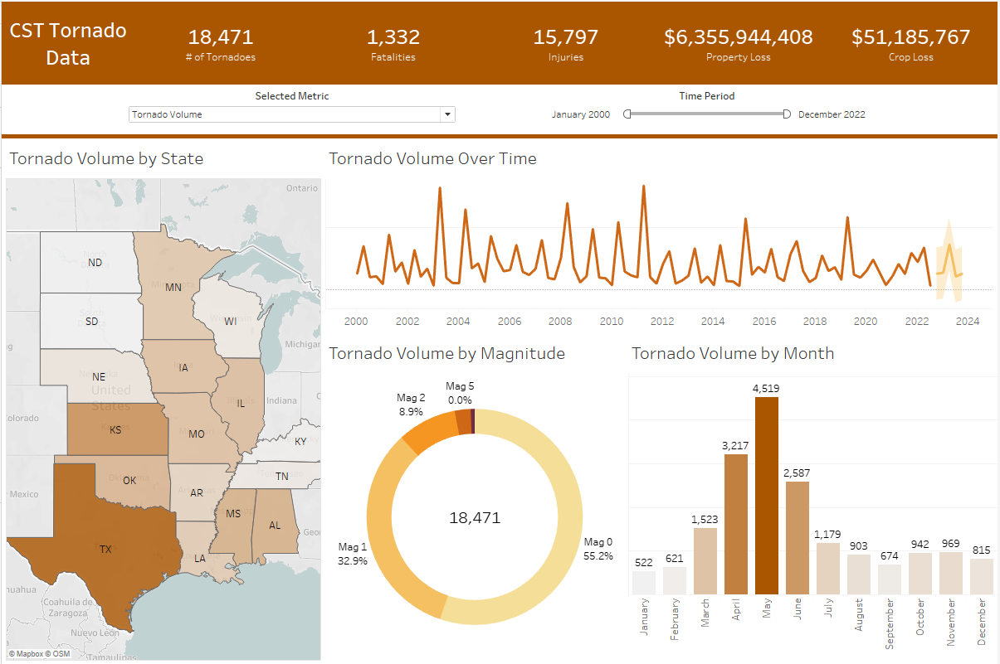

# SQL Tornado Analysis & Tableau Dashboard

Overview 

The goal of this project was to explore and visualize tornado data within the United States to gain an understanding of their destructive nature. The data used was provided by the Regional Centre for Mapping of Resources for Development (RCMRD), covering 68,701 entries from 1950 to 2022. Each entry is an individual tornado with attributes such as magnitude, injuries, property loss, and distance covered (etc.). The first half of this project involved loading the data into SQL for cleaning, optimization, and analysis. The second took a subset of the data in the CST time zone from 2000 to 2022 for further exploration and visualization within Tableau for the creation of a dashboard. 

https://opendata.rcmrd.org/datasets/fedmaps::tornado-tracks-1/about

SQL Process

Upon loading the data into Microsoft SQL Server, I reviewed the columns, data types, and data formats. I then renamed many of the columns for clarity and usability by referencing the source metadata. Once completed, I ensured that the OBJECTID column was the unique identifier, fixed the data formats of the time and date columns, and checked for duplicates and nulls. From there I reviewed the qualitative attributes for incorrect or misleading entries and addressed them as necessary. In doing so I noticed that the time zone information was not usable for analysis, thus I created my own time zone column. For the majority of states, it was a simple task of grouping, but the states that reside in two time zones required longitudinal parameters. Before moving to EDA, I dropped any unnecessary columns. 

With the cleaning done, I reviewed the MIN and MAX values of the qualitative attributes to ensure they were within reason with regards to the other attributes. Once checked, I aggregated the sum of measures ( number of tornadoes, injuries, fatalities, property loss, crop loss) by year, time zone, and state. Next, I took a look at averages by magnitude and property loss by state with adjustable dates. After that, I secluded the deadliest tornado per year using a CTE with the dense_rank window function. Then, using a CTE of CTE with dense_rank, I identified the state with the most injuries each year. - For the dashboard, I decided to isolate recent data within the most active time zone, being CST. 

CST Tableau  Dashboard Process 

Having the end dashboard in mind, I created a parameter that allows for the selection of the metric/measure that you want to filter for. I then used this parameter in a calculated field to grab the data based on the selection. This setup is used as the main filter of the dashboard. Building upon that, I created a map of the CST time zone, a time-series chart, a donut chart of magnitude, and a monthly bar chart that all change to the selected measure. A date slider was then added for further filtering. Once these components worked properly, I cleaned up the formats, axis, and labels while setting a uniform theme (font, color, alignment, etc.). In tandem, I ensured the Titles and Tooltips were dynamic and legible. Finally, I made a summary table to display the total values of each metric. From there I set up the dashboard, did a rough layout before entering final layout measures, and tested the functionality. - Later on, forecasting was added to the time-series chart. 

https://public.tableau.com/app/profile/gavin.wilson/viz/TornadoData2000-2022/Dashboard1

